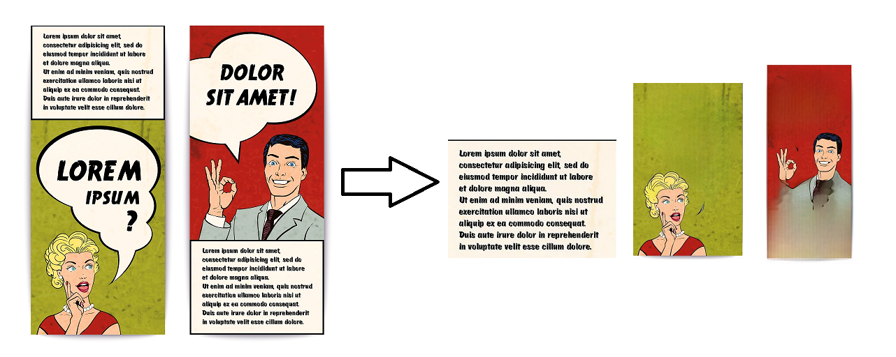
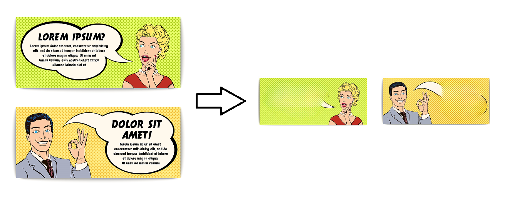
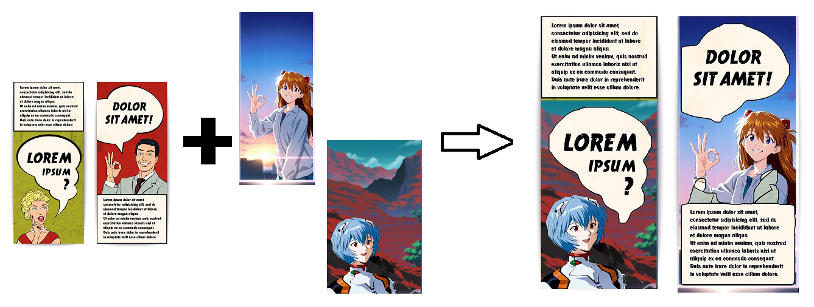

# Speech Bubble Remove and Copy Tool

This is a tool to remove or copy the speech bubbles.

- Remove all speech bubbles from the image. (source image / cleaned image)  
- (As you can see from this example, not all speech bubbles can be captured completely. Or maybe the sample images aren't suitable...)  



- Copy all speech bubbles in image A to image B. (source image(A) / base image(B) / base image with speech bubble)  




## Installation(for windows)
[Python 3.10](https://www.python.org/) and git client must be installed  

```sh
git clone https://github.com/s9roll7/speech_bubble_remove_and_copy.git
cd speech_bubble_remove_and_copy
py -3.10 -m venv venv
venv\Scripts\activate.bat
# Please install torch according to your environment.(https://pytorch.org/get-started/locally/)
python -m pip install torch torchvision torchaudio --index-url https://download.pytorch.org/whl/cu121
pip install -r requirements.txt
```

## How To Use

run launch_cmd.bat  

```sh
# remove
python main.py remove SRC_IMAGE_DIR_PATH

#!! Create base images based on the clean images.
#!! and put it in BASE_IMAGE_DIR with the "same file name".

# copy
python main.py copy SRC_IMAGE_DIR_PATH BASE_IMAGE_DIR_PATH


```
or

```sh
# remove
#  prepare your project directory
#  my_proj_1/
#        src/ <--- put source images here


#  with comic panel extraction
python main.py remove_proj PROJ_DIR_PATH

or

#  without comic panel extraction
python main.py remove_proj PROJ_DIR_PATH --split=False

# copy
#  prepare your project directory
#  my_proj_1/
#        src/ <--- put source images here
#        base/ <--- put base images here

#!! Create base images based on the clean images.
#!! and put it in "my_proj_1/base" with the "same file name".

python main.py copy_proj PROJ_DIR_PATH
```

## Advanced Settings
### Switching models
If you want to include text as well as speech bubbles in the process, you need to use a different model.  
Download the "adetailerForTextSpeech" model from civitai, Place it in the following location.  
data/models/adetailerForTextSpeech_v20/unwantedV10x.pt  
Use the following command.  
```sh
# remove
python main.py remove_proj PROJ_DIR_PATH --model_type=1

# copy
python main.py copy_proj PROJ_DIR_PATH --model_type=1
```

If you want to use a different model, edit YOLO_SEG_MODEL_LOCATION(in bubble_tool.py)  


## Changelog
### 2024-12-22
Added comic panel extraction function  
Changed lama model  


## Related resources
- [simple-lama-inpainting](https://github.com/enesmsahin/simple-lama-inpainting)
- [yolov8m_seg-speech-bubble](https://huggingface.co/kitsumed/yolov8m_seg-speech-bubble)
- [magi](https://github.com/ragavsachdeva/magi)
- [AnimeMangaInpainting](https://huggingface.co/dreMaz/AnimeMangaInpainting)


